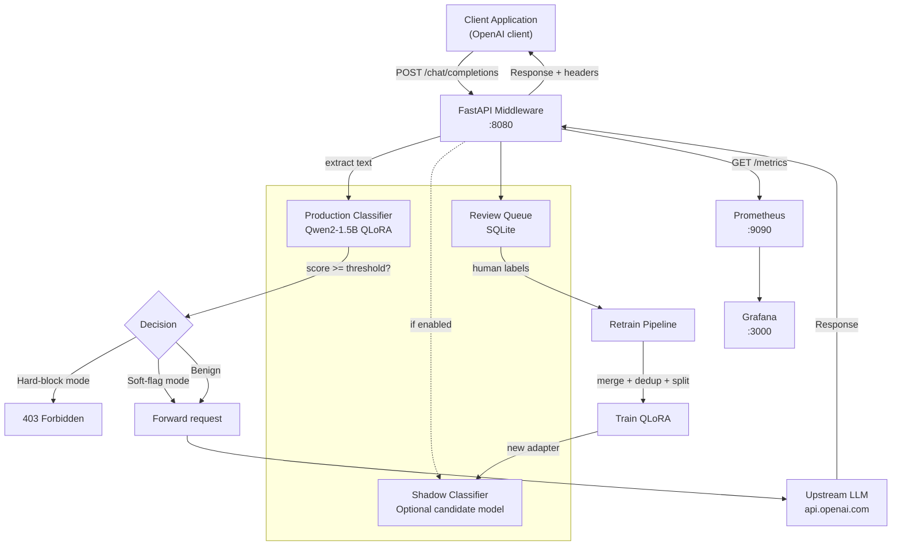

# Prompt Injection Detector

A lightweight, real-time prompt injection detection guardrail that sits as middleware in front of any OpenAI-compatible LLM endpoint. Fine-tuned from Qwen2-1.5B using QLoRA for sequence classification, with Prometheus/Grafana monitoring, shadow mode evaluation, and a continuous retraining pipeline.

## Architecture



## Project Structure

```
├── configs/              # Training & dataset configs, Prometheus config
├── data/                 # Raw and processed datasets
├── eval/                 # Evaluation results, calibration curves, metrics
├── learning/             # Documentation notes on calibration, deployment, etc.
├── middleware/            # FastAPI middleware + classifier serving
│   ├── app.py            # FastAPI application with /chat/completions proxy
│   ├── classifier.py     # QLoRA-tuned Qwen2 classification model
│   ├── config.py         # Pydantic-based settings (.env)
│   └── example_client.py # Usage example
├── models/               # Fine-tuned checkpoint (LoRA adapters)
├── scripts/              # Data pipeline, training, evaluation scripts
│   ├── prepare_dataset.py
│   ├── train_qlora.py
│   ├── evaluate_baseline.py / evaluate_model.py
│   ├── calibrate.py
│   ├── build_adversarial_eval.py
│   ├── analyze_dataset.py
│   ├── review_queue.py   # Human review CLI
│   └── retrain.py        # Continuous retraining pipeline
└── src/
    ├── data/             # Dataset loaders, deduplication, balancing
    └── utils/            # Shared utilities (config loading)
```

## Quick Start

### 1. Install dependencies

```bash
pip install -r requirements.txt
pip install -r middleware/requirements.txt
```

### 2. Prepare the dataset

```bash
python scripts/prepare_dataset.py --config configs/dataset_config.yaml
```

### 3. Train the model

```bash
python scripts/train_qlora.py --config configs/training_config.yaml
```

### 4. Run the middleware

```bash
# Configure via .env or environment variables
export LLM_ENDPOINT="https://api.openai.com/v1"
export LLM_API_KEY="sk-..."
export THRESHOLD=0.85
export MODE="soft_flag"

python -m middleware.app
```

Or use Docker Compose for the full monitoring stack:

```bash
docker compose up -d
# Grafana: http://localhost:3000 (admin/admin)
# Prometheus: http://localhost:9090
# Middleware: http://localhost:8080
```

## Usage

Point your LLM client at `http://localhost:8080/v1` instead of the default OpenAI endpoint:

```python
from openai import OpenAI

client = OpenAI(base_url="http://localhost:8080/v1", api_key="sk-...")

response = client.chat.completions.create(
    model="gpt-4",
    messages=[{"role": "user", "content": "Hello!"}],
)
```

In `soft_flag` mode (default), detected injections are forwarded with an `X-Injection-Detected` header. In `hard_block` mode, a 403 is returned.

## Configuration

| Variable | Default | Description |
|---|---|---|
| `LLM_ENDPOINT` | `https://api.openai.com/v1` | Upstream LLM endpoint |
| `LLM_API_KEY` | `""` | API key for upstream LLM |
| `THRESHOLD` | `0.85` | Confidence threshold for flagging |
| `MODE` | `soft_flag` | `soft_flag` or `hard_block` |
| `MODEL_PATH` | `models/qwen-injection-detector/best` | Path to LoRA checkpoint |
| `HOST` | `0.0.0.0` | Middleware listen address |
| `PORT` | `8080` | Middleware listen port |
| `MAX_LENGTH` | `512` | Max input tokens for classifier |
| `SHADOW_ENABLED` | `false` | Enable shadow mode (dual model) |
| `SHADOW_MODEL_PATH` | `""` | Path to shadow LoRA checkpoint |
| `REVIEW_QUEUE_PATH` | `data/review_queue.db` | SQLite review queue path |
| `REVIEW_NEAR_THRESHOLD` | `0.1` | Near-threshold margin for logging to review queue |

## Monitoring

- **Prometheus** metrics: request count, blocked/flagged count, confidence histogram, latency histogram, shadow agreement/disagreement counters
- **Grafana** dashboards: injection attempt rates, confidence drift, latency P50/P99, model status
- **Metrics endpoint**: `GET /metrics`

### Shadow Mode

Deploy a candidate model alongside production with no user-facing impact:

```bash
export SHADOW_ENABLED=true
export SHADOW_MODEL_PATH=models/qwen-injection-detector/shadow
```

Every request is classified by both models. Metrics track agreement rate and confidence delta. Run a human review loop via:

```bash
python scripts/review_queue.py --stats          # Queue statistics
python scripts/review_queue.py --limit 20       # Interactive review CLI
python scripts/review_queue.py --export labels.jsonl  # Export for retraining
```

## Retrain Pipeline

After collecting human-reviewed labels, retrain the model:

```bash
python scripts/retrain.py --shadow
```

This merges reviewed labels with the original training data, re-deduplicates, re-splits, runs QLoRA training + calibration, and optionally copies the new model to the shadow path.

## Training Data

The model is trained on a combination of public prompt injection datasets:

- `deepset/prompt-injections`
- `S-Labs/prompt-injection-dataset`
- `xTRam1/safe-guard-prompt-injection`
- `Lakera/gandalf_ignore_instructions`
- `HuggingFaceH4/no_robots` (benign examples)

A hand-authored adversarial eval set targeting obfuscation, encoding, translation, and multi-turn attacks is used for evaluation only.

## Evaluation Results

| Metric | Value |
|--------|-------|
| Accuracy | 98.73% |
| Macro F1 | 0.9857 |
| Injection Recall | 97.83% |
| Benign Recall | 99.18% |
| Temperature (learned) | 3.51 |

Full metrics, calibration curves, and baseline comparisons in [`MODEL_CARD.md`](./MODEL_CARD.md) and the `eval/` directory.

## License

MIT
